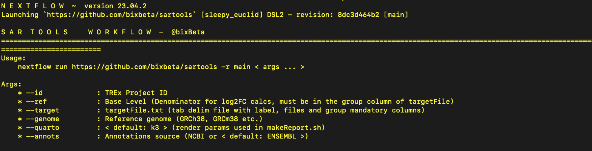

[](https://github.com/bixBeta/sartools/actions/workflows/docker-build.yml)
[](https://github.com/bixBeta/sartools/pkgs/container/sartools)

`nextflow pull bixBeta/sartools -r main `


`nextflow run bixBeta/sartools -r main --help `



---

> **BioHPC Server Users:** Use the `g2` branch which is configured for Singularity instead of Docker.
> ```
> nextflow run bixBeta/sartools -r g2 --help
> ```
